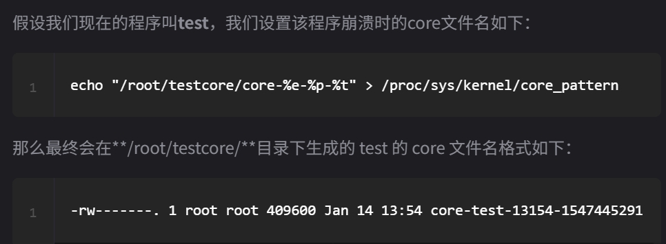

## 一.gdb调试准备
### 生成一个带调试信息的程序
```
gcc -g -o hello_server hello_server.c
#-g选项同样也适用于使用makefile、cmake等工
#建议关闭编译器的程序的优化选项,关闭优化的目的是为了调试的时候，符号文件显示的调试变量等能与源代码完全对应起来,O0表示不优化（关闭优化）
```
###  如何判断hello_server带有调试信息?
```
gdb hello_server#会显示调试信息
```
### 使用Linux的strip命令移除掉某个程序中的调试信息
```
strip 可执行文件
#我们通常会在程序测试没问题后，需要发布到生产环境或者正式环境，会生成不带调试符号信息的程序，以减小程序体积或提高程序执行效率。
```
### 启动gdb调试的三种方法
#### 方法一 直接调试目标程序,即调试源程序的执行文件
```
gdb filename
#直接使用gdb启动一个程序进行调试，也就是说这个程序还没有启动，只是利用gcc编译了，还没运行执行文件
```
#### 方法二 附加进程
```
#1.一个程序已经启动了，我们想调试这个程序，但是又不想重启这个程序（因为法一是在没有run运行的情况下调试的，所以这里不能再`Ctrl+c`回到gcc和run之间的gdb调试步骤
ps -ef | grep chatserver
gdb attach 42921

#2.当用gdb attach上目标进程后，调试器会暂停下来，此时我们可以使用continue命令让程序继续运行，或者加上相应的断点再继续运行程序。

#3.在gdb的命令行界面输入detach命令让程序与 gdb 调试器分离，这样chatserver可以继续运行,然后再退出gdb就可以了
(gdb) detach
Detaching from program: /home/zhangyl/flamingoserver/chatserver, process 42921
(gdb) quit
```
#### 方法三 调试core文件 —— 定位进程崩溃问题
```
#1.ulimit -a查看系统的一些功能
#2.ulimit -c unlimited即ulimit 选项名 设置值来修改core file size开启，并设置成不限制大小
#3.为使得后台服务器一直运行（守护进程），ulimit -c unlimited可以加到/etc/profile。。。。。。
#4.某个程序当时运行时其进程ID是16663，那么如果其崩溃产生的core文件的名称是core.16663
#5.gdb msg_server core.21985 得到总的报错信息
#6.(gdb) bt 查看崩溃时的调用堆栈，堆栈#0~#3是系统库函数调用序列，都是经过反复测试过的，一般不存在问题；堆栈#4~#12是我们自己的业务逻辑调用序列，我们可以排查这部分代码进而定位到问题原因
#7.要知道崩溃产生的core文件名中的PID对应哪个业务，可以在程序启动时，记录一下PID。当然也可以控制产生的core文件的文件名中是否添加PID
 - /proc/sys/kernel/core_uses_pid可以控制产生的core文件的文件名中是否添加PID作为扩展，如果添加则文件内容为1，否则为0
 - /proc/sys/kernel/core_pattern可以设置格式化的core文件保存位置或文件名
    - 修改： echo "/corefile/core-%e-%p-%t" > /proc/sys/kernel/core_pattern，添加了程序名字（e），core生成时间（t），pid
```


### gdb TUI模式（更好的看代码）
1. `gdbtui -q` 需要调试的程序名
2. 用切换键`Ctrl + x + a`调出gdbtui
3. `layout + 窗口类型`命令来进行选择自己需要的窗口
4. 当前gdb tui窗口放大或者缩小以后，gdbtui窗口中的内容不会自己刷新以适应新的窗口尺寸，我们可以通过`space`键强行让gdbtui窗口刷新。

## 二.gdb常用命令详解,在gdb命令行界面如果直接按下回车键，默认是将最近一条命令重新执行一遍
### break,可简写成b，tbreak命令是一个临时断点,continue可简写成c
```
## 在函数名为functionname的入口处添加一个断点 
break functionname                 
## 在当前文件行号为LineNo处添加一个断点
break LineNo                            
## 在filename文件行号为LineNo处添加一个断点,最常用
break filename:LineNo
  - 当设置多个断点的时候，使用run重启调试程序的时候
     - 程序第一次会触发main函数处的断点，我们输入continue命令继续运行，接着触发anet.c:455行的断点         
```
### backtrace（bt）与frame(f)命令,可以用来理清楚调用层级关系，通常用在调试加上断点之后
```
## backtrace，可简写成bt，用来查看当前所在线程的调用堆栈
## 想切换到其他堆栈处，可以使用frame，可简写成f
frame 堆栈编号（编号不用加#）eg: f 1  *注意这里是切换一个线程内部的堆栈
```
###  info break（info b）、enable、disable、delete命令，用于操控断点
```
# 列出断点
info b
# 禁用断点 disable 编号（由info b得来）
disable 1
# 重启禁用的断点 enable 编号（由info b得来）
enable 1
# 删除断点 delete 编号（由info b得来）
delete 2 3
```
###  list（l） 命令(使用频率很高），用于查看当前断点附近的代码
```
# 第一次l,会显示断点处前后10行代码
# 第二次l,会显示第一次l最后一行再往后10行代码。。。。。。
# 另外，命令'list +'可以从当前代码位置向下显示10行代码（往文件末尾方向），这和连续输入多条list命令效果是一样的
# list -命令(即list 减号)可以从当前代码位置向上显示10行代码（往文件开始方向）
```
###  print（p）和ptype 命令,用于调试过程中方便地查看变量的值，也可以修改当前内存中的变量值
```
# p输出变量值，并且可以指定输出格式
(gdb) p server.ipfd
$2 = {0 <repeats 16 times>}# gdb的优化，节约显示空间
(gdb) print /format variable
     o octal 八进制显示
     x hex 十六进制显示
     d decimal 十进制显示
     u unsigned decimal 无符号十进制显示
     t binary 二进制显示
     f float 浮点值显示
     a address 内存地址格式显示(与十六进制相似)
     i instruction 指令格式显示
     s string 字符串形式显示
     z hex, zero padded on the left 十六进制左侧补0显示
      eg:(gdb) p /x server.port
          $6 = 0x1900
# p高级用法
  - C++:p this来显示当前对象的地址,p *this来列出当前对象的各个成员变量值
  - p a+b+c来打印这三个变量的结果值
  - p func()命令可以输出该变量的执行结果
    eg：程序执行失败通过系统变量errno得到一个错误码，用p调用函数：p strerror(errno)，将这个错误码 
        对应的文字信息打印出来
# p修改变量的值
(gdb) p server.port=6400
# ptype输出一个变量的类型
eg:(gdb) ptype server.port
type = int 
```
### info和thread命令
```
- 用法一：info thread和bt结合确定主线程和工作线程
   因为bt显示的是我目前线程的调用堆栈，即为主线程
- 用法二：thread命令切换到其他线程，之后可以用bt查看该线程的堆栈。*这就是与f命令的区别
   eg:thread 线程编号
- 用法三：nfo命令还可以用来查看当前函数的参数值
   eg:
   (gdb) info args
   eventLoop = 0x5e5770
   flags = 27
```
### next(n)、step（s）、until(u)、finish、return、jump(j)命令
补充：函数调用方式，我们常用的函数调用方式有**__cdecl**、__stdcall，C++的非静态成员函数的调用方式是**__thiscall**，函数参数的传递本质上是函数参数的入栈的过程，而这三种调用方式参数的入栈顺序都是从右往左的
```
# n作用是让gdb跳到下一行代码.这里跳到下一行代不是说一定跳到代码最近的下一行，而是根据程序逻辑跳转到相应的位置。遇到函数调用不进入函数体内部而直接跳过（单步步过）
# s命令就是”单步步入“（step into），顾名思义，就是遇到函数调用，进入函数内部。
  eg:b main在main函数处加一个断点，然后使用r命令重新跑一下程序，会触发刚才加在main函数处的断点，然 
  后使用n命令让程序走到spt_init(argc, argv)函数调用处，再输入s命令就可以进入该函数了
# finish命令，在实际调试的时候，我们在某个函数中调试一会儿后，我们不需要再一步步执行到函数返回处，我们希望直接执行完当前函数并回到上一层调用处 *注意要执行完才退出
# return命令的作用是结束执行当前函数，同时可以指定该函数的返回值 *不执行完直接退出
# until（u）使用这个命令让程序运行到指定行停下来，根据它这个“运行到“，可以取代l命令来使用u 2774命令让gdb直接跳到2774行，这样就能快速执行完2740 ~ 2774行中间的代码（不包括2774行）。当然，我们也可以先在2774行加一个断点，然后使用continue命令运行到这一行来达到同样的效果，但是使用until命令显然更方便。
# j会让程序执行流跳转到指定位置执行
j location
  - 其行为也是不可控制的，例如跳过了某个对象的初始化代码，直接执行操作该对象的代码，那么可能会导致程序崩溃或其他意外行为
  - 如果jump跳转到的位置没有设置断点，那么gdb执行完跳转操作后，会继续往下执行,因此如果我们想查看执行跳转处的代码后的结果，需要在location处设置断点
  - 除了跳过一些代码的执行外，还有一个妙用就是可以执行一些我们想要执行的代码，而这些代码在正常的逻辑下可能并不会执行
```
### disassemble命令（汇编）
在某些场景下，我们可能要通过查看某段代码的汇编指令去排查问题，或者在调试一些不含调试信息的 release 版程序时，只能通过反汇编代码去定位问题
gdb反汇编格式默认为AT&T格式，可以通过show disassembly-flavor查看当前反汇编格式。如果读者习惯阅读intel汇编格式，可以使用set disassembly-flavor intel命令来设置

### set args（传递命令行参数）与show args命令(查看命令行参数是否设置成功)
正确的做法是在用gdb附加程序后，在使用run命令之前，使用set args 命令行参数来指定
```
# 设置和查看
(gdb) set args ../redis.conf 
(gdb) show args
Argument list to give program being debugged when it is started is "../redis.conf ".
# 清除
(gdb) set args
(gdb) show args
Argument list to give program being debugged when it is started is "".
```
### watch命令（监视变量或者内存）
当这个变量或者该内存处的值发送变化时，gdb就会中断下来。监视某个变量或者某个内存地址会产生一个“watch point”（观察点）。当设置的观察点是一个局部变量时。局部变量无效后，观察点也会失效。**watch命令就实际上可能会通过添加硬件断点来达到监视数据变化的目的**
1. 整形变量
```
int i;  
watch i
```
2. 指针类型
```
char *p; 
watch p 与 watch *p
#watch p与watch *p是有区别的，前者是查看*(&p)， 是p变量本身；后者是p所指的内存的内容，一般是我们所需要的，我们大多数情况就是要看某内存地址上的数据是怎样变化的。
```
3. watch一个数组或内存区间
```
char buf[128];
watch buf
```
### display命令（监视变量或者内存值）
每次 gdb 中断下来都会自动输出这些被监视变量或内存的值。某个程序有一些全局变量，每次触发断点gdb中断下来，希望可以自动输出这些全局变量的最新值，那么就可以使用display命令。display命令使用格式是display 变量名/内存地址/寄存器名。可以使用info display查看当前已经监视了哪些值，使用delete display清除全部被监视的变量，使用delete display 编号移除对指定变量的监视。
```
0x00007ffff71e2603 in epoll_wait () from /usr/lib64/libc.so.6
(gdb) display $ebx
1: $ebx = 24068
(gdb) display /x $ebx
2: /x $ebx = 0x5e04
(gdb) display $eax
3: $eax = -4
(gdb) b main
Breakpoint 2 at 0x436abd: file server.c, line 5001.
(gdb) r
The program being debugged has been started already.
Start it from the beginning? (y or n) y
Starting program: /root/redis-6.0.3/src/redis-server 
...省略部分输出...
Breakpoint 2, main (argc=1, argv=0x7fffffffe308) at server.c:5001
5001        spt_init(argc, argv);
1: $ebx = 0
2: /x $ebx = 0x0
3: $eax = 4418219
(gdb)
```
### dir命令——让被调试的可执行程序匹配源代码
即产生可执行文件的机器和使用可执行文件的机器不是同一台，无法用用gdb调试core文件。或者由于一些原因，编译时的源码文件被挪动了位置，使用gdb调试时也会出现上述情况。-g只是加了一个可执行程序与源码之间的**位置**映射关系
```
# 加一个源文件路径到当前路径的前面,指定多个路径，可以使用”:”
dir SourcePath1:SourcePath2:SourcePath3
```
`show dir`查看当前设置了哪些源码搜索路径
`dir`命令不加参数表示清空当前已设置的源码搜索路径
## 三.使用gdb调试_多线程_程序的总结
1. 使用gdb将程序跑起来，然后按Ctrl + c将程序中断下来，使用`info threads`命令查看当前进程有多少线程
2. 使用`thread 线程编号`可以切换到对应的线程去，然后使用`bt`命令可以查看对应线程从顶到底层的函数调用，以及上层调用下层对应的源码中的位置；当然，你也可以使用`frame` 栈函数编号（栈函数编号即下图中的#0 ~ #4，使用frame命令时不需要加#）切换到当前函数调用堆栈的任何一层函数调用中去，然后分析该函数执行逻辑，使用`print`等命令输出各种变量和表达式值，或者进行单步调试
3. 希望执行流一直在某个线程执行,也就是说我就盯着某个线程调试这个线程，因为存在CPU时间片切换。我们单步调试线程A时，我们不希望线程A函数中的值被其他线程改变
   - 因此,gdb提供了一个将程序执行流锁定在当前调试线程的命令选项——scheduler-locking选项，这个选项有三个值，分别是on、step和off。
   - set scheduler-locking on可以用来锁定当前线程，只观察这个线程的运行情况， 当锁定这个线程时， 其他线程就处于了暂停状态，也就是说你在当前线程执行next、step、until、finish、return命令时，其他线程是不会运行的
   - set scheduler-locking step也是用来锁定当前线程，当且仅当使用next或step命令做单步调试时会锁定当前线程，如果你使用until、finish、return等线程内调试命令（它们不是单步控制命令），所以其他线程还是有机会运行的
   - set scheduler-locking off用于释放锁定当前线程
   `set scheduler-locking on/step/off`
## 四.使用gdb调试_多进程_程序,gdb调试父子进程
nginx对客户端的连接是采用多进程模型，当nginx接受客户端连接后，创建一个新的进程来处理该连接上的信息来往。新产生的进程与原进程互为父子关系
### 方法一：
用gdb先调试父进程，等子进程被fork出来后，使用gdb attach到子进程上去
## 五.gdb实用调试技巧
### 将print输出的字符串或字符数组显示完整
当我们使用print命令打印一个字符串或者字符数组时，如果该字符串太长，print命令默认显示不全的，我们可以通过在gdb中输入set print element 0设置一下。
```
(gdb) n
563         os << "{\"code\": 0, \"msg\": \"ok\", \"userinfo\":" << friendlist << "}";
(gdb) p friendlist
$1 = "[{\"members\":[{\"address\":\"\",\"birthday\":19900101,\"clienttype\":0,\"customface\":\"\",\"facetype\":2,\"gender\":0,\"mail\":\"\",\"markname\":\"\",\"nickname\":\"bj_man\",\"phonenumber\":\"\",\"signature\":\"\",\"status\":0,\"userid\":4,"...
(gdb) set print element 0
(gdb) p friendlist       
$2 = "[{\"members\":[{\"address\":\"\",\"birthday\":19900101,\"clienttype\":0,\"customface\":\"\",\"facetype\":2,\"gender\":0,\"mail\":\"\",\"markname\":\"\",\"nickname\":\"bj_man\",\"phonenumber\":\"\",\"signature\":\"\",\"status\":0,\"userid\":4,\"username\":\"13811411052\"},{\"address\":\"\",\"birthday\":19900101,\"clienttype\":0,\"customface\":\"\",\"facetype\":0,\"gender\":0,\"mail\":\"\",\"markname\":\"\",\"nickname\":\"Half\",\"phonenumber\":\"\",\"signature\":\"\",\"status\":0,\"userid\":5,\"username\":\"15618326596\"},{\"address\":\"\",\"birthday\":19900101,\"clienttype\":0,\"customface\":\"\",\"facetype\":34,\"gender\":0,\"mail\":\"\",\"markname\":\"\",\"nickname\":\"云淡风轻\",\"phonenumber\":\"\",\"signature\":\"\",\"status\":0,\"userid\":7,\"username\":\"china001\"},...太长了，这里省略...
```

