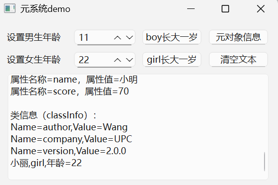

1. QSpinBox调用过程，也就是上下箭头的调用过程
> 点击spinBox按钮增还是减已经在界面显示，剩下的要与内部其他逻辑联系起来，相当于发了个信号signal->connect中的ui->spinBoy或者ui->spinGirl信号出现->进入槽函数do_spinChanged->判断是spinBoy还是spinGirl，这里通过为ui设置动态属性setProperty->
property读取属性值->调用TPerson实例的setAge方法(不用incAge就是因为有加有减)->setAge方法内部emit ageChanged(m_age)signal函数->调用connect函数->进入槽函数do_ageChanged->里面有根据动态属性sex判断boy还是girl
2. QPushBotto调用过程，也就是按下长大一岁的调用过程
> 点击QPushBotton按钮->调用on_btnBoyInc_click->调用incAge()-> emit ageChanged(m_age)->调用connect函数->调用do_ageChanged->里面有根据动态属性sex判断boy还是girl
3. 其中还用到了对象的属性
4. 结果显示

