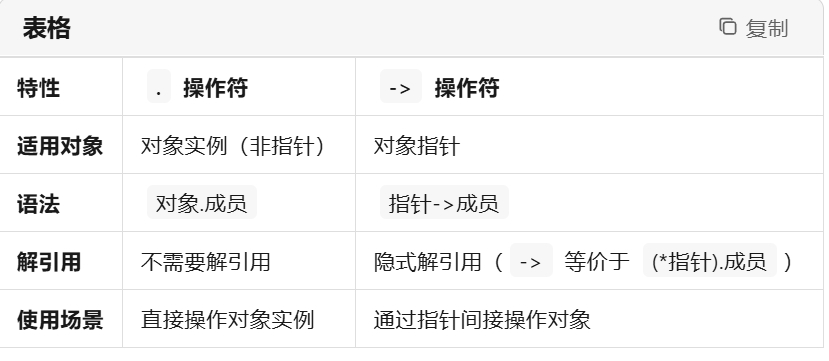

对于QMainWindow中的一些无法用可视化UI添加的控件，可以使用代码进行添加

> QToolBar 是一个工具栏控件，通常用于放置按钮、下拉列表、输入框等控件，以便用户快速访问常用功能。
QStatusBar 是一个状态栏控件，通常位于窗口的底部，用于显示应用程序的状态信息，如文件名、进度条、提示信息等
QMainWindow 是 Qt 提供的一个主窗口类，用于构建具有菜单栏、工具栏、状态栏和中心部件的应用程序。

```
+-------------------+
|      QWidget      |
+-------------------+
          |
          +-------------------+
          |                   |
+---------+---------+         |
|   QMainWindow      |         |
+-------------------+         |
| + QToolBar        |         |
| + QStatusBar      |         |
| + QTextEdit       |         |
+-------------------+         |
          |       |       |         |
          |       |       |         |
+---------+       +-------+         +----------------+
| QToolBar |       | QStatusBar |       | QTextEdit  |
|----------|       |-------------|       |------------|
| + QAction|       | + QLabel    |       | - setFont  |
| + QSpinBox|       | + QProgressBar |    | - setFontPointSize |
| + QFontComboBox|   | + addPermanentWidget |   | - setFont  |
+----------+       +-------------+       +------------+
          |       |       |         |
          |       |       |         |
+---------+       +-------+         |
| QSpinBox |       | QLabel  |         |
|----------|       |----------|         |
| - setMinimum  |   | - setText  |         |
| - setMaximum  |   | - setMinimumWidth |         |
| - setValue    |   +------------------+         |
+----------+       |                   |
          |       |                   |
+---------+       |                   |
| QFontComboBox |  |                   |
|---------------|                   |
| - setMinimumWidth |                  |
| - setFont         |                  |
+-------------------+                  |
关系说明
QWidget
功能：所有 Qt 控件的基类。
作用：提供基本的控件功能，如窗口标题、边框、事件处理等。
QMainWindow
继承自：QWidget
功能：主窗口类，用于构建复杂的应用程序。
组合关系：
包含工具栏（QToolBar）
包含状态栏（QStatusBar）
包含中心部件（如 QTextEdit）
QToolBar
继承自：QWidget
功能：工具栏控件，用于放置工具按钮和其他控件。
组合关系：
包含按钮（QAction 或 QPushButton）
包含下拉列表（QComboBox）
包含输入框（QSpinBox）
QStatusBar
继承自：QWidget
功能：状态栏控件，用于显示状态信息。
组合关系：
包含标签（QLabel）
包含进度条（QProgressBar）
包含永久区域（addPermanentWidget）
QSpinBox
继承自：QAbstractSpinBox
功能：用于选择整数值的控件。
方法：
setMinimum(int)：设置最小值
setMaximum(int)：设置最大值
setValue(int)：设置当前值
QFontComboBox
继承自：QComboBox
功能：用于选择字体样式的控件。
方法：
setMinimumWidth(int)：设置最小宽度
setFont(const QFont &font)：设置当前字体
QLabel
继承自：QWidget
功能：用于显示文本或图像的控件。
方法：
setText(const QString &text)：设置显示文本
setMinimumWidth(int)：设置最小宽度
QProgressBar
继承自：QWidget
功能：用于显示进度的控件。
方法：
setMinimum(int)：设置最小值
setMaximum(int)：设置最大值
setValue(int)：设置当前值
QTextEdit
继承自：QAbstractScrollArea
功能：用于显示和编辑多行文本的控件。
方法：
setFont(const QFont &font)：设置字体
setFontPointSize(int)：设置字体大小
```

一.  操作符
使用场景：用于访问对象的成员。
适用对象：对象本身是一个实例（非指针）。
语法：对象.成员
```
class MyClass {
public:
    int value;
    void print() {
        std::cout << "Value: " << value << std::endl;
    }
};

int main() {
    MyClass obj;  // 创建一个对象实例
    obj.value = 10;  // 使用 . 操作符访问成员变量
    obj.print();     // 使用 . 操作符调用成员函数
    return 0;
}
```
二. -> 操作符
使用场景：用于访问指针所指向对象的成员。
适用对象：对象是一个指针。
语法：指针->成员
```
class MyClass {
public:
    int value;
    void print() {
        std::cout << "Value: " << value << std::endl;
    }
};

int main() {
    MyClass* ptr = new MyClass();  // 创建一个对象指针
    ptr->value = 20;  // 使用 -> 操作符访问成员变量
    ptr->print();     // 使用 -> 操作符调用成员函数
    delete ptr;       // 释放指针指向的对象
    return 0;
}
```
三. 区别总结



四. 特殊情况
在现代 C++ 中，智能指针（如 std::unique_ptr 和 std::shared_ptr）也使用 -> 操作符来访问成员。这是因为智能指针重载了 -> 操作符，使其能够像普通指针一样使用。
```
#include <memory>
#include <iostream>

class MyClass {
public:
    int value;
    void print() {
        std::cout << "Value: " << value << std::endl;
    }
};

int main() {
    std::unique_ptr<MyClass> ptr = std::make_unique<MyClass>();  // 智能指针
    ptr->value = 30;  // 使用 -> 操作符访问成员变量
    ptr->print();     // 使用 -> 操作符调用成员函数
    return 0;
}
```
五. 栈分配和堆分配
在 C++ 中，是否需要使用 delete 来释放对象，取决于对象的分配方式。具体来说，这与对象是通过栈分配（自动存储期）还是通过堆分配（动态存储期）有关
```
1. 栈分配（自动存储期）
定义：对象在栈上分配，其生命周期由作用域决定。
特点：
对象在定义时自动分配内存。构造函数会在变量定义的那一刻被调用
当对象的作用域结束时，析构函数会被自动调用,内存会自动释放，不需要手动调用 delete。
通常用于局部变量。
eg:
void func(){
MyClass obj;  // 栈分配,构造函数被调用
obj.value = 10;
obj.print();
}//析构函数被调用
解释：obj 是一个栈分配的对象，当 main 函数结束时，obj 的内存会自动释放，不需要手动调用 delete。
```
```
2. 堆分配（动态存储期）
定义：对象在堆上分配，其生命周期由程序员控制。
特点：
使用 new 关键字动态分配内存。
需要手动使用 delete 释放内存，否则会导致内存泄漏。
通常用于需要动态分配内存的场景。
eg:
MyClass* ptr = new MyClass();  // 堆分配，构造函数此刻会被调用
ptr->value = 20;
ptr->print();
delete ptr;  // 必须手动释放内存，析构函数此刻会被调用。
解释：ptr 是一个指向堆分配对象的指针。使用 new 分配的内存必须用 delete 释放，否则会导致内存泄漏。
```
```
3. 智能指针
定义：智能指针（如 std::unique_ptr 和 std::shared_ptr）自动管理动态分配的内存。
特点：
智能指针在析构时自动调用 delete 释放内存。
使用智能指针可以避免手动管理内存，减少内存泄漏的风险。
eg:
std::unique_ptr<MyClass> ptr = std::make_unique<MyClass>();  // 智能指针，此刻调用构造函数。
ptr->value = 30;
ptr->print();
// 不需要手动调用 delete，智能指针会自动释放内存
解释：智能指针 ptr 在析构时会自动调用 delete 释放内存，因此不需要手动调用 delete。
```
六. 在 C++ 中，使用类名直接调用成员函数（通常称为“静态绑定”或“编译时多态”）与使用对象实例（. 操作符）或对象指针（-> 操作符）调用成员函数（“动态绑定”或“运行时多态”）有显著区别。这些区别主要体现在调用时机、访问权限和使用场景上。

1. 直接使用类名调用（静态绑定/编译时多态）
> 特点：
这种方式通常用于调用类的**静态成员函数或构造函数**。
调用在编译时就已经确定，即编译器根据函数名和参数类型在编译期间就决定调用哪个函数。
不能用于调用非静态成员函数，因为非静态成员函数的调用需要对象实例。
```
class MyClass {
public:
    static void staticFunction() {
        std::cout << "Static function called." << std::endl;
    }

    void nonStaticFunction() {
        std::cout << "Non-static function called." << std::endl;
    }
};

int main() {
    MyClass::staticFunction();  // 正确：调用静态成员函数
    // MyClass::nonStaticFunction();  // 错误：不能直接通过类名调用非静态成员函数
    MyClass obj;
    obj.nonStaticFunction();  // 正确：通过对象实例调用非静态成员函数
    return 0;
}
```

2. 使用对象实例调用（. 操作符）
> 特点：
这种方式用于通过对象实例调用**非静态成员函数**。
调用在运行时确定，即根据对象的实际类型来决定调用哪个函数（如果涉及继承和多态）。
直接操作对象实例。
```
class Base {
public:
    virtual void show() { std::cout << "Base show" << std::endl; }
    //声明 show() 函数为虚函数。这意味着在派生类中可以重写（override）这个函数，并且在运行时可以根据对象的实际类型来调用相应的函数。
};

class Derived : public Base {
public:
    void show() override { std::cout << "Derived show" << std::endl; }
    //重写（override）基类中的 show() 函数。override 关键字是可选的，但它可以作为文档，表明这个函数是有意重写基类中的虚函数。如果基类函数不是虚函数或者签名不匹配，编译器会报错。
};

int main() {
    Base b;
    Derived d;
    b.show();  // 输出 "Base show"
    d.show();  // 输出 "Derived show"
    return 0;
}
```
3. 使用对象指针调用（-> 操作符）
> 特点：
这种方式用于通过对象指针调用**成员函数，可以是静态或非静态成员函数**。
非静态成员函数的调用在运行时确定，即根据指针指向对象的实际类型来决定调用哪个函数（如果涉及继承和多态）。通过指针间接操作对象。
```
class Example {
public:
    void function() { std::cout << "Function called." << std::endl; }
};

int main() {
    Example obj;
    Example* ptr = &obj;
    ptr->function();  // 输出 "Function called."
    return 0;
}
```