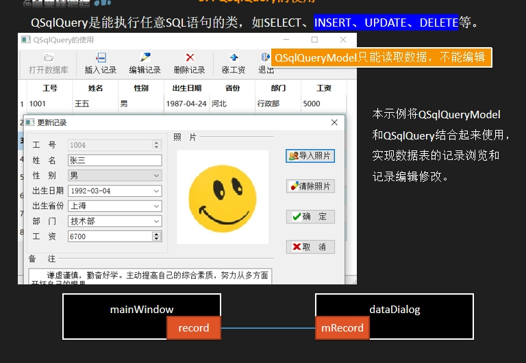

QSqlQuery负责与数据库的各项操作。


QSqlRecord负责作为一条记录
```c++
QSqlQuery query;
query.exec("select * from employee where EmpNo=-1");
SqlRecord curRec=query.record();//获得一条空数据
```
```c++
int curRecNo=selModel->currentIndex().row();
QSqlRecord curRec=qryModel->record(curRecNo);
```
