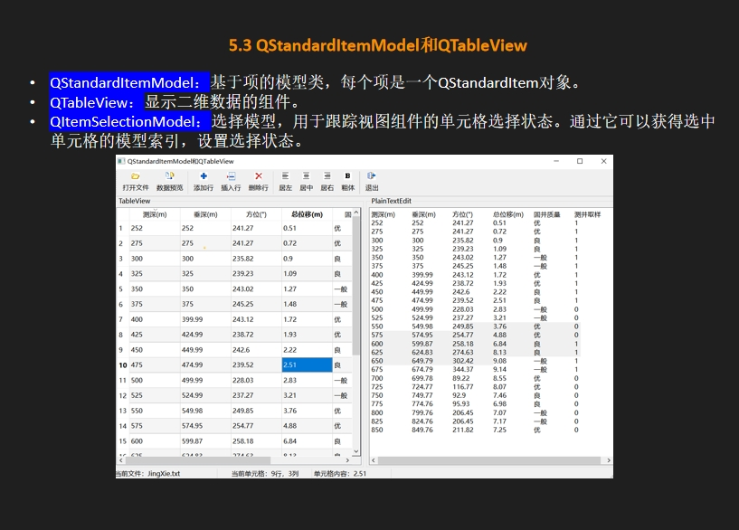

QStandardItemModel以UI作为parent
QItemSelectionModel以UI作为parent,并与与QStandardItemModel模型关联
QTableView与QStandardItemModel和QItemSelectionModel相关联
QStandardItemModel里面的QStandardItem以QStandardItemModel作为parent,因为m_model->setItem(i-1,j,QStandardItem);

> 加载文件模块,QTableView变化导致QStandardItemModel的例子
1. void MainWindow::on_actOpen_triggered()     动作action触发槽函数，实现文件打开操作功能
2. void MainWindow::iniModelData(QStringList &aFileContnet)   文本文件的内容转换为表格形式，并将其初始化到视图模型中
   实现QTableView的改变添加内容，能够让QStandardItemModel里面的数据同步更新数据，所以这里的函数充当了代理的作用

> QItemSelectionModel返回当前选中值的索引的例子
 connect(m_selection,&QItemSelectionModel::currentChanged,this,&MainWindow::do_currentChanged);
以&QItemSelectionModel::currentChanged作为信号signal函数，通过它可以获得选中单元格的模型索引，设置选择状态。
```
void MainWindow::do_currentChanged(const QModelIndex &current, const QModelIndex &previous)
{
    Q_UNUSED(previous)
    if(current.isValid()){
        labCellPos->setText(QString::asprintf("当前单元格：%d行，%d列",
                                              current.row(),current.column()));
        //获取当前单元格的内容，注意这里是通过QStandardItemModel里面的itemFromIndex项来获取的
        QStandardItem *aItem=m_model->itemFromIndex(current);//QStandardItemModel::itemFromIndex()函数通过当前索引返回当前单元格的QStandardItem项
        labCellText->setText("单元内容："+aItem->text());
        ui->actFontBold->setChecked(aItem->font().bold());//aItem->font().bold()的功能是获取当前单元格的字体font()是否加粗bold(),返回true或false，action的checked属性是bool类型的，所以可以直接赋值
    }
}
```
> QStandardItemModel变化导致QTableView的例子
1. void MainWindow::on_actModelData_triggered()将 QStandardItemModel（m_model）中的数据导出到 QPlainTextEdit 控件中显示

> 在表格模型中追加一行新数据，利用QList<QStandardItem*> aItemList;列表往QStandardItemModel里面加数据的例子
最后借助QItemSelectionModel->setCurrentIndex设置当前选中的行
顺序为QTableView功能触发   定义QList<QStandardItem*> aItemList    调用QStandardItemModel  通过QItemSelectionModel->setCurrentIndex显示


> 在表格模型中删除一行数据
顺序为QTableView功能触发  通过QItemSelectionModel->setCurrentIndex获取当前选中的索引（即要删除的数据行索引） QStandardItemModel->removeRow操作model


`QModelIndexList indexList=m_selection->selectedIndexes();`