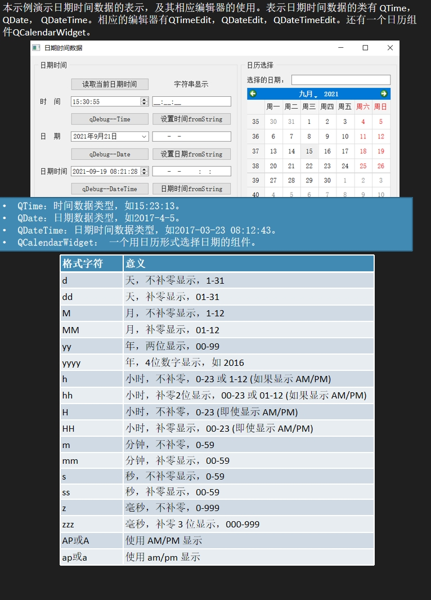

> 一般采取先设置全面的QDataTime类，然后再设置QTime,QDate类
> 对于QLineEdit类中，有一个inputMask可以对输入的内容做格式化的处理，eg:99:99:99;_ 对应_:q_:_

```
void Widget::on_btnGetTime_clicked()
{
    QDateTime curDateTime=QDateTime::currentDateTime();
    ui->timeEdit->setTime(curDateTime.time());
    ui->editTime->setText(curDateTime.toString("hh:mm:ss"));

    ui->dateEdit->setDate(curDateTime.date());
    ui->editDate->setText(curDateTime.toString("yyyy-MM-dd"));

    ui->dateTimeEdit->setDateTime(curDateTime);
    ui->editDateTime->setText(curDateTime.toString("yyyy-MM-dd hh:mm:ss"));
}
使用的 Qt 类和方法
QDateTime：Qt 框架中的日期和时间类。
QDateTime::currentDateTime()：获取当前的日期和时间。
QDateTime::time()：获取 QDateTime 对象中的时间部分。
QDateTime::date()：获取 QDateTime 对象中的日期部分。
QDateTime::toString(const QString&)：将日期和时间格式化为指定的字符串格式。
QTimeEdit：Qt 框架中的时间选择控件。
QTimeEdit::setTime(const QTime&)：设置时间。
QLineEdit：Qt 框架中的单行文本输入框控件。
QLineEdit::setText(const QString&)：设置文本内容。
QDateEdit：Qt 框架中的日期选择控件。
QDateEdit::setDate(const QDate&)：设置日期。
QDateTimeEdit：Qt 框架中的日期和时间选择控件。
QDateTimeEdit::setDateTime(const QDateTime&)：设置日期和时间
代码结构
这个方法的逻辑非常清晰，主要分为以下几个部分：
获取当前的日期和时间。
分别设置到不同的控件中：
时间设置到 QTimeEdit 和 QLineEdit。
日期设置到 QDateEdit 和 QLineEdit。
日期和时间设置到 QDateTimeEdit 和 QLineEdit。
```
```
一些成员函数
QTime：Qt 框架中的时间类。
QTime::toString(const QString&)：将时间格式化为字符串。
QTime::addSecs(int)：在当前时间基础上增加指定秒数。
QTime::currentTime()：获取当前时间。
QTime::hour()、QTime::minute()、QTime::second()、QTime::msec()：获取时间的各个组成部分。
QDate：Qt 框架中的日期类。
QDate::toString(const QString&)：将日期格式化为字符串。
QDate::daysTo(const QDate&)：计算两个日期之间的天数差。
QDate::currentDate()：获取当前日期。
QDate::year()、QDate::month()、QDate::day()、QDate::dayOfWeek()：获取日期的各个组成部分。
QDateTime：Qt 框架中的日期和时间类。
QDateTime::currentDateTime()：获取当前日期和时间。
QDateTime::toString(const QString&)：将日期和时间格式化为字符串。
QDateTime::date()、QDateTime::time()：分别提取日期部分和时间部分。
QDateTime::toSecsSinceEpoch()：将日期和时间转换为自 Unix 纪元以来的秒数。
QDateTime::setSecsSinceEpoch(qint64)：根据秒数设置日期和时间。
```
```
void Widget::on_btnSetTime_clicked()
{
    QString str=ui->editTime->text();
    str=str.trimmed();
    if(!str.isEmpty()){
        QTime tm=QTime::fromString(str,"hh:mm:ss");
        ui->timeEdit->setTime(tm);
    }
}


void Widget::on_btnSetDate_clicked()
{
    QString str=ui->editDate->text();
    str=str.trimmed();
    if (!str.isEmpty())
    {
        QDate dt=QDate::fromString(str,"yyyy-MM-dd");
        ui->dateEdit->setDate(dt);
    }
}


void Widget::on_btnSetDateTime_clicked()
{
    QString str=ui->editDateTime->text();
    str=str.trimmed();
    if (!str.isEmpty())
    {
        QDateTime datetime=QDateTime::fromString(str,"yyyy-MM-dd hh:mm:ss");
        ui->dateTimeEdit->setDateTime(datetime);
    }
}


void Widget::on_calendarWidget_selectionChanged()
{
    QString str=ui->calendarWidget->selectedDate().toString("yyyy年M月d日");
    ui->editCalendar->setText(str);
}
使用的 Qt 类和方法
QLineEdit：Qt 框架中的单行文本输入框控件。
QLineEdit::text()：获取当前文本。
QLineEdit::setText(const QString&)：设置文本内容。
QTime：Qt 框架中的时间类。
QTime::fromString(const QString&, const QString&)：从字符串中解析时间。
QDate：Qt 框架中的日期类。
QDate::fromString(const QString&, const QString&)：从字符串中解析日期。
QDateTime：Qt 框架中的日期和时间类。
QDateTime::fromString(const QString&, const QString&)：从字符串中解析日期和时间。
QTimeEdit：Qt 框架中的时间选择控件。
QTimeEdit::setTime(const QTime&)：设置时间。
QDateEdit：Qt 框架中的日期选择控件。
QDateEdit::setDate(const QDate&)：设置日期。
QDateTimeEdit：Qt 框架中的日期和时间选择控件。
QDateTimeEdit::setDateTime(const QDateTime&)：设置日期和时间。
QCalendarWidget：Qt 框架中的日历控件。
QCalendarWidget::selectedDate()：获取选中的日期。
```