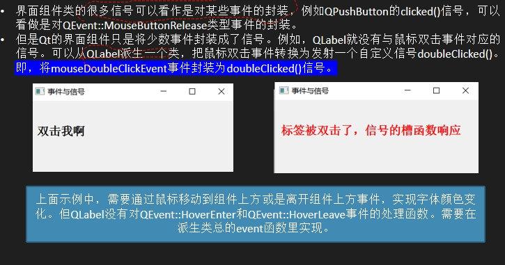
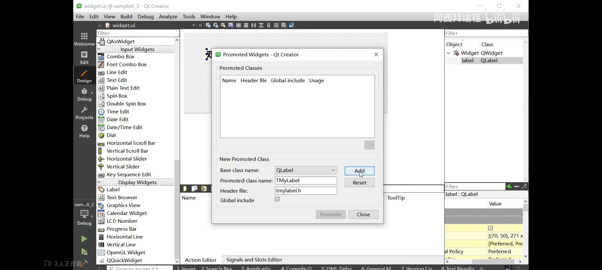

# 解决普通事件函数并不能实现功能，需要自己定义信号，里面封装事件函数的情况

## 封装QWight的事件函数为QWight组件的信号函数

## 这个过程涉及将QWight组件提升为对应的事件函数



```
void TMyLabel::mouseDoubleClickEvent(QMouseEvent *event)
{
    Q_UNUSED(event);
    emit doubleClicked();
}
//TMyLabel是QLabel的派生类，mouseDoubleClickEvent是QLabel组件中的事件，这里将其进行了重写，里面的emit doubleClicked();说明了重写事件函数的功能，即发送信号，这里就实现了封装QWight的事件函数为QWight组件的信号函数
```


```
bool TMyLabel::event(QEvent *event)
{
    if(event->type()==QEvent::HoverEnter)
    {
        QPalette plet=this->palette();
        plet.setColor(QPalette::WindowText,Qt::red);
        setPalette(plet);
    }else if(event->type()==QEvent::HoverLeave){
        QPalette plet=this->palette();
        plet.setColor(QPalette::WindowText,Qt::black);
        setPalette(plet);
    }

    return QLabel::event(event);
}
//这里是重写的TMyLabel的基类QLabel的基类QWight的基类的QObeject的事件函数event，然后由QObject的派生类QLabel来处理事件
```