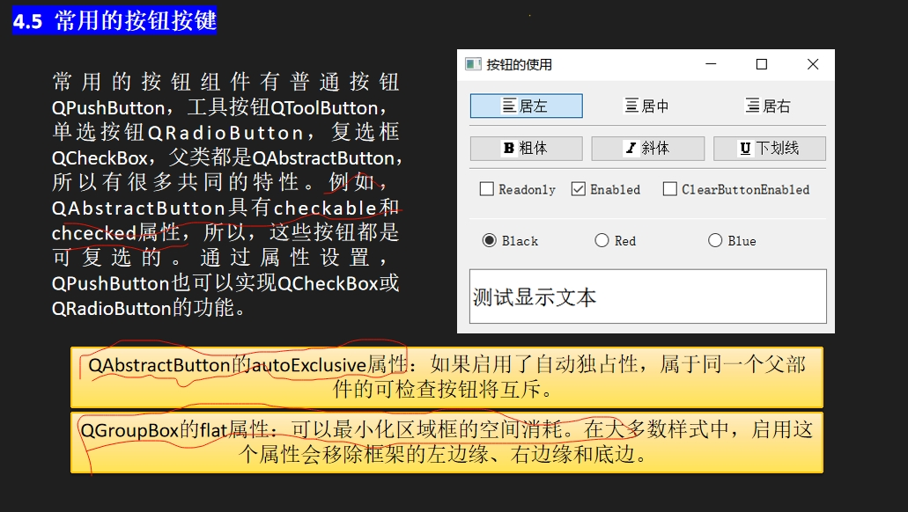

> 通过属性设置，QPushButton也可以实现QCheckBox或QRadioButton的功能。也就是说，这个例子里面一开始全是QPushButton

> 要先选择上checkable（即可选择的），然后再设置QAbstractButton的autoExclusive属性。这样才能实现独占性

> 对于单选框，选择clicked()即可，对于复选框，选择clicked(bool)

```
QLineEdit：Qt 框架中的单行文本输入框控件。
QLineEdit::setAlignment(Qt::Alignment)：设置文本的对齐方式。
QLineEdit::font()：获取当前字体。
QLineEdit::setFont(const QFont&)：设置新的字体。以QFont字体类作为函数的参数
QLineEdit::setReadOnly(bool)：设置控件为只读状态或可编辑状态。
QLineEdit::setEnabled(bool)：启用或禁用控件（继承自 QWidget）。
QLineEdit::setClearButtonEnabled(bool)：启用或禁用清除按钮。
QLineEdit::palette()：获取当前控件的调色板。
QLineEdit::setPalette(const QPalette&)：设置控件的调色板。以QPalette颜色类作为函数的参数
```
```
Qt::Alignment：Qt 中定义的对齐方式枚举。
Qt::AlignLeft：左对齐。
Qt::AlignCenter：居中对齐。
Qt::AlignRight：右对齐。
Qt::GlobalColor：Qt 中定义的全局颜色枚举。
Qt::black：黑色。
Qt::red：红色。
Qt::blue：蓝色。
```
```
QFont：Qt框架中的字体类，用于表示字体的各种属性（如加粗、斜体、下划线等）。
QFont::setBold(bool)：设置字体是否加粗。
QFont::setItalic(bool)：设置字体是否斜体。
QFont::setUnderline(bool)：设置字体是否带有下划线。
QPalette：Qt 框架中的调色板类，用于管理控件的颜色属性。
QPalette::setColor(QPalette::ColorRole, const QColor&)：设置调色板中指定颜色角色的颜色。
QPalette::Text：表示文本颜色的角色。
```