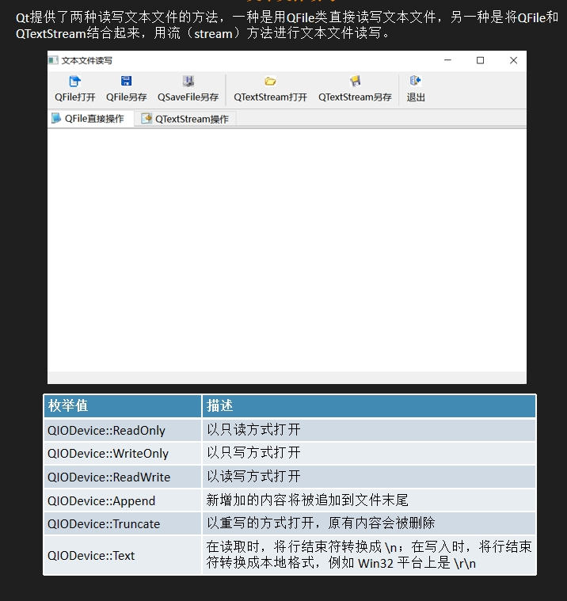

## 以只读方式打开文件的过程
```
QString MainWindow::getFile(bool save)
{
    QString curPath=QCoreApplication::applicationDirPath();
    QString dlgTitle="选择一个文件";
    QString filter="程序文件(*.h *.cpp);;文本文件(*.txt);;所有文件(*.*)";
    QString aFileName;
    if(save)
        aFileName=QFileDialog::getSaveFileName(this,dlgTitle,curPath,filter);
    else
        aFileName=QFileDialog::getOpenFileName(this,dlgTitle,curPath,filter);

    if(aFileName.isEmpty())
        return aFileName;//如果用户没有选择文件（即 aFileName 为空），直接返回空字符串。


    QFileInfo fileInfo(aFileName);//创建一个 QFileInfo 对象，用于解析文件路径信息
    QDir::setCurrent(fileInfo.absoluteFilePath());//使用 QDir::setCurrent 将当前工作目录设置为所选文件的绝对路径
    return aFileName;//返回用户选择的文件路径
}
void MainWindow::on_actOpen_IODevice_triggered()
{
    //用只读的方式打开一个文件
    QFile aFile(getFile());//根据上面的文件路径
    if(!aFile.exists())
        return;
    if(!aFile.open(QIODevice::ReadOnly|QIODevice::Text))
        return;
    ui->textEditDevice->appendPlainText(aFile.readAll());
    aFile.close();
}
一 打开保存文件和打开文件的对话框QCoreApplication,QFileDialog
1. QCoreApplication::applicationDirPath
2. dlgTitle
3. aFileName，QFileDialog::getSaveFileName，QFileDialog::getOpenFileName
二 获取所选文件路径QFileInfo
QFileInfo fileInfo(aFileName)
三 操作所选文件QFile
1. QFile aFile(getFile())
2. aFile.exists()
3. aFile.open()
4. aFile.readAll()
5. aFile.close()
void MainWindow::on_actOpen_TextStream_triggered()
{
    QFile aFile(getFile());
    if(!aFile.exists())
        return;
    if(!aFile.open(QIODevice::ReadOnly|QIODevice::Text))
        return;
    QTextStream aStream(&aFile);
    aStream.setAutoDetectUnicode(true);
    while(!aStream.atEnd())
    {
        QString str=aStream.readLine();
        ui->textEditStream->appendPlainText(str);
    }
    aFile.close();
}
```