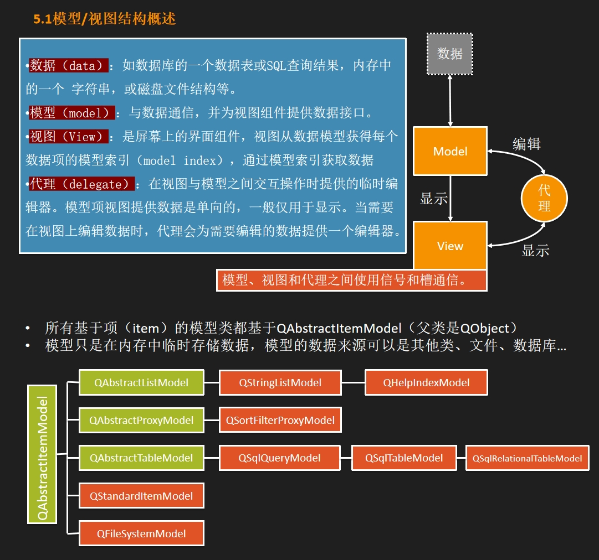
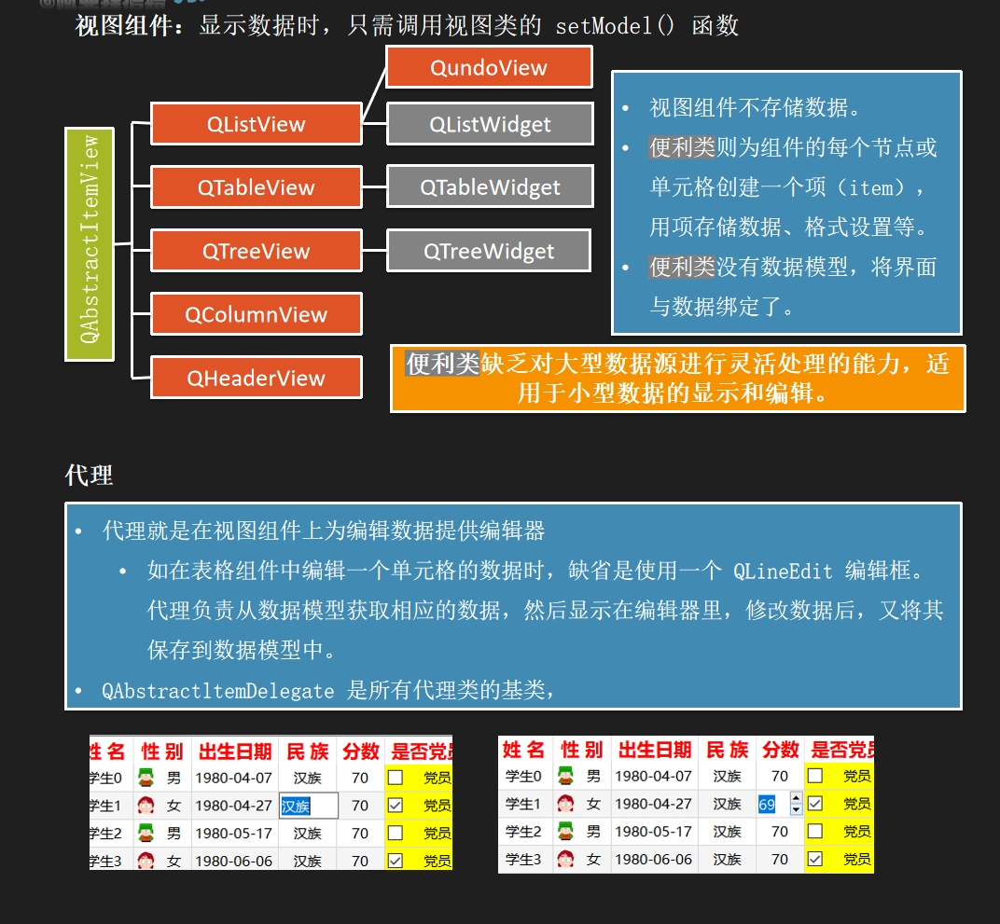
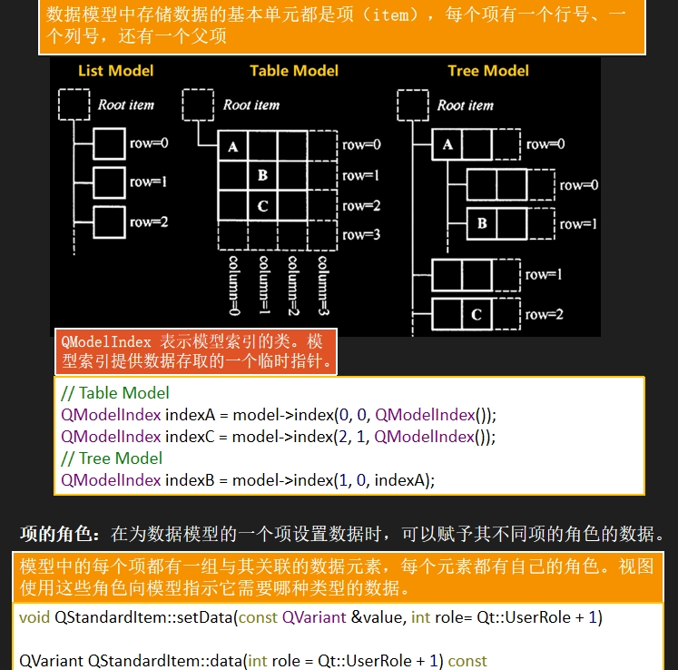

# 第一张图介绍了模型 视图
> 1. model和view之间是单向传递，如果需要双向，则要用到代理
  2. QAbstractItemModel里面有一个QSqlRelationalTableMode用于操作关系型数据库



# 第二张图介绍了 QAbstractItemView视图基类，QAbstractltemDelegate 是所有代理类的基类



# 第三张图介绍了数据模型中存储数据的数据结构，以及QModelIndex 表示模型索引的类




```
> 总述：为了使数据模型更加灵活和强大，Qt 引入了“角色”（Role）的概念。角色允许你为模型中的每个项（Item）关联多种类型的数据，而不仅仅是显示文本。
> 角色的概念
    1.角色（Role）：是一个整数，用于标识项（Item）中存储的数据类型。Qt 定义了一些预设的角色，如 Qt::DisplayRole（用于显示文本）、Qt::EditRole（用于编辑文本）等，同时也允许你定义自定义角色。
    2.数据元素：每个项可以有多个数据元素，每个元素都与一个特定的角色相关联。
> 使用角色
    1.设置数据：使用 setData 方法为项设置数据时，你可以指定一个角色。如果不指定角色，通常使用 Qt::UserRole + 1 作为默认角色。
       void QStandardItem::setData(const QVariant &value, int role= Qt::UserRole + 1)
       功能：为 QStandardItem 的某个角色设置数据。
       参数：
           const QVariant &value：要设置的值，QVariant 可以存储任何类型的数据。
           int role= Qt::UserRole + 1：指定角色，默认为 Qt::UserRole + 1，这是一个自定义角色的起始值。
    2.获取数据：使用 data 方法从项获取数据时，也需要指定角色。
       QVariant QStandardItem::data(int role = Qt::UserRole + 1) const
       功能：从 QStandardItem 获取与指定角色关联的数据。
       参数：
            int role = Qt::UserRole + 1：指定角色，默认为 Qt::UserRole + 1。
```

```
// 创建一个 QStandardItem
QStandardItem *item = new QStandardItem("File.txt");

// 设置文件路径，使用自定义角色，例如 UserRole + 1
item->setData(QVariant("/path/to/File.txt"), Qt::UserRole + 1);

// 设置最后修改时间，使用另一个自定义角色，例如 UserRole + 2
QDateTime lastModified = QFileInfo("/path/to/File.txt").lastModified();
item->setData(QVariant(lastModified), Qt::UserRole + 2);

// 稍后，当你需要获取文件路径时
QString filePath = item->data(Qt::UserRole + 1).toString();

// 获取最后修改时间
QDateTime lastModifiedTime = item->data(Qt::UserRole + 2).toDateTime();
```