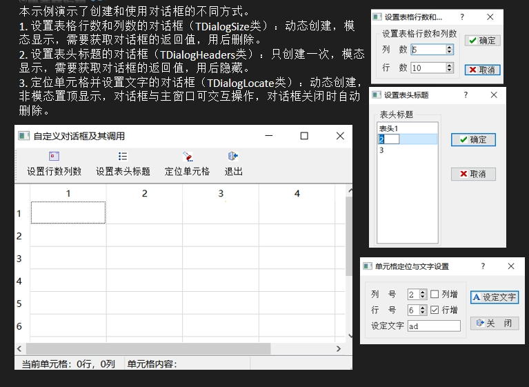
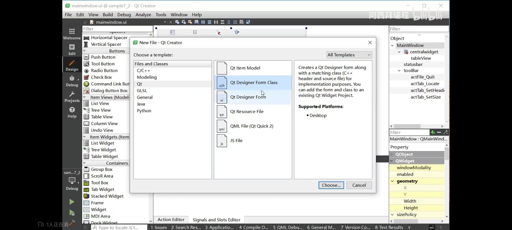
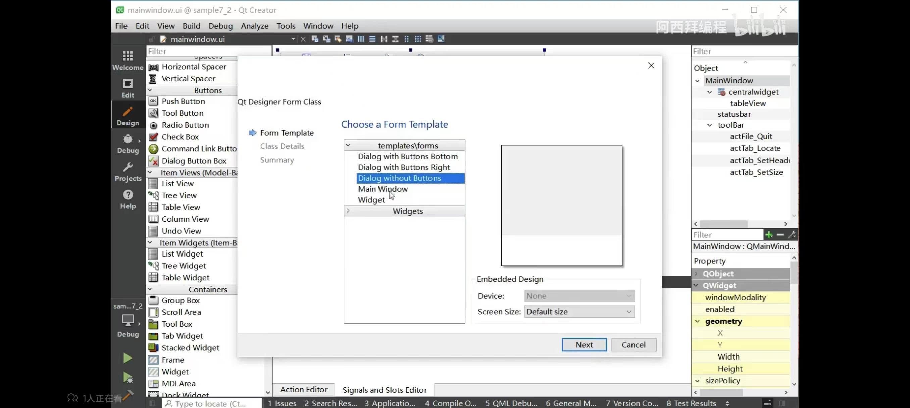

## 自定义对话框
> 


> 相当于又多了一个页面，所以：




## 不同界面之间的public接口
```
//接收主界面meanwindows的传来的参数
void TDialogSize::setRowColumn(int row, int column)
{
    ui->spinBoxRow->setValue(row);
    ui->spinBoxColumn->setValue(column);
}
//返回给主界面值
int TDialogSize::rowCount()
{
    return ui->spinBoxRow->value();
}

int TDialogSize::columnCount()
{
    return ui->spinBoxColumn->value();
}
```


## 模态和非模态
> 模态对话框（Modal Dialog）
模态对话框是指在对话框显示期间，用户必须先完成对话框中的操作（如点击“确定”或“取消”按钮），才能继续与父窗口或其他窗口交互。换句话说，模态对话框会阻塞用户对其他窗口的操作，直到对话框被关闭。在Qt中，使用 exec() 函数显示对话框时，对话框将以模态方式显示。exec() 会显示对话框，并且会阻塞代码的执行，直到对话框被关闭。对话框关闭后，**exec() 函数会返回一个值（通常是 QDialog::Accepted 或 QDialog::Rejected）**，表示用户是通过点击“确定”还是“取消”按钮关闭对话框的。在对话框显示期间，用户无法与父窗口或其他窗口交互。
`int ret = dlgTableSize->exec();`


> 非模态对话框（Non-Modal Dialog）
非模态对话框是指在对话框显示后，用户仍然可以与父窗口或其他窗口交互。非模态对话框不会阻塞代码的执行，也不会阻塞用户对其他窗口的操作。在Qt中，使用 show() 或 open() 函数显示对话框时，对话框将以非模态方式显示。show() 会显示对话框，但不会阻塞代码的执行。对话框显示后，用户可以自由地在对话框和父窗口之间切换。对话框关闭时，不会返回值，需要通过**信号和槽机制**来处理对话框的关闭事件。
`dlgTableSize->show();`

