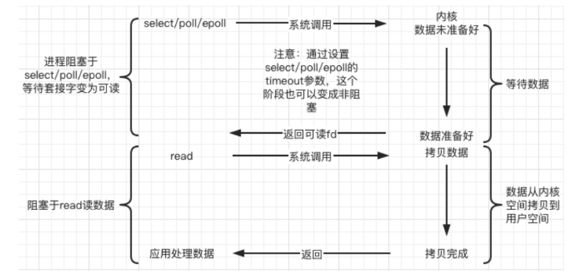
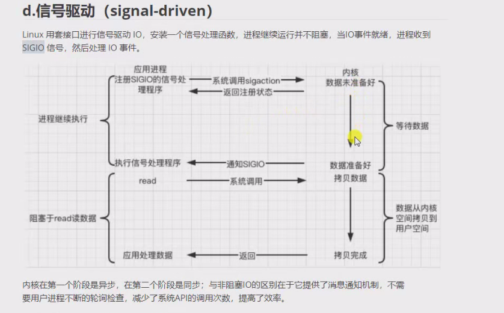
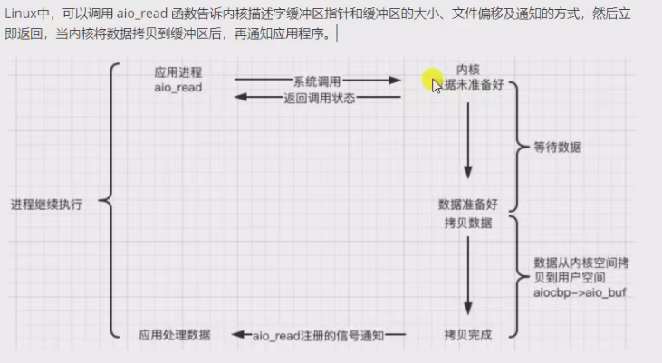

**五种模型从数据就绪和数据读写两个阶段的不同组合方式来划分**

## IO多路复用模型

```
IO复用（IO multiplexing）  
1.Linux 用 select/poll/epoll 函数实现 IO 复用模型，这些函数也会使进程阻塞
2.但是和阻塞IO所不同的是这些函数可以同时阻塞多个IO操作。而且可以同时对多个读操作、写操作的IO函数进行检测。直到有数据可读或可写时，才真正调用IO操作函数。
```

## 信号驱动（signal-driven）

```
1.Linux 用套接口进行信号驱动 IO，安装一个信号处理函数，进程继续运行并不阻塞，当IO事件就绪，进程收到SIGIO 信号，然后处理 IO 事件
2.内核在第一个阶段是异步，在第二个阶段仍然是同步；与非阻塞IO的区别在于它提供了消息通知机制，不需要用户进程不断的轮询检查，减少了系统API的调用次数，提高了效率
```

## 异步（asynchronous）

> Linux中，可以调用 aio_read 函数告诉内核描述字缓冲区指针和缓冲区的大小、文件偏移及通知的方式，然后立即返回，当内核将数据拷贝到缓冲区后，再通知应用程序
```
struct aiocb
{
  int aio_fildes;       /* File desriptor.  */
  int aio_lio_opcode;       /* Operation to be performed.  */
  int aio_reqprio;      /* Request priority offset.  */
  volatile void *aio_buf;   /* Location of buffer.  */
  size_t aio_nbytes;        /* Length of transfer.  */
  struct sigevent aio_sigevent; /* Signal number and value.  */
  /* Internal members.  */
  struct aiocb *__next_prio;
  int __abs_prio;
  int __policy;
  int __error_code;
  __ssize_t __return_value;
#ifndef __USE_FILE_OFFSET64
  __off_t aio_offset;       /* File offset.  */
  char __pad[sizeof (__off64_t) - sizeof (__off_t)];
#else
  __off64_t aio_offset;     /* File offset.  */
#endif
  char __glibc_reserved[32];
};
```