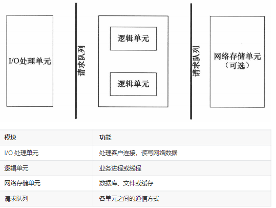
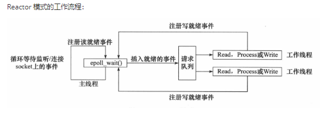
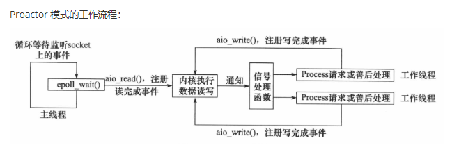
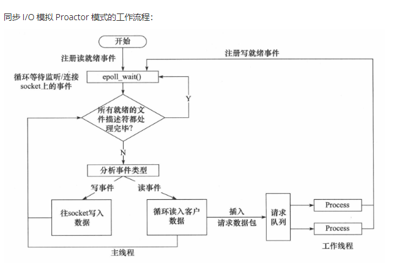

## 流程

## 常见的web服务器
Tomcat,Nginx

## 注意
1. I/O 处理单元是服务器管理客户连接的模块。它通常要完成以下工作：**等待并接受**新的客户连接，**接收**客户数据，将服务器响应数据**返回**给客户端。但是**数据的收发不一定在 I/O 处理单元中**执行，也可能在逻辑单元中执行，具体在何处执行取决于事件处理模式。
2. 一个逻辑单元通常是一个进程或线程。它**分析并处理**客户数据，然后将结果传递给 I/O 处理单元或者直接发送给客户端（具体使用哪种方式取决于事件处理模式）。服务器通常拥有**多个**逻辑单元，以实现对多个客户任务的**并发**处理。
3. 网络存储单元可以是数据库、缓存和文件，但不是必须的。
3. 请求队列是**各单元之间的通信方式**的抽象。I/O 处理单元接收到客户请求时，需要以某种方式通知一个逻辑单元来处理该请求。同样，多个逻辑单元同时访问一个存储单元时，也需要采用某种机制来协调处理竞态条件。请求队列通常被实现为**池**的一部分。有进程池（通信需要管道，映射），线程池（共享缓冲区）

## 两种高效的事件处理模式
服务器程序通常需要处理三类事件：**I/O 事件**、信号及定时事件。有两种高效的事件处理模式：Reactor 和 Proactor，**同步 I/O 模型通常用于实现 Reactor 模式，异步 I/O 模型通常用于实现 Proactor 模式**

### Reactor模式
要求**主线程**（I/O处理单元）只负责**监听**文件描述符上是否有事件发生，有的话就立即将该事件通知工作线程（逻辑单元），**将 socket 可读可写事件放入请求队列**，交给工作线程处理。除此之外，主线程不做任何其他实质性的工作。**读写数据，接受新的连接，以及处理客户请求**均在工作线程中完成。

使用**同步 I/O（以 epoll_wait 为例）实现的 Reactor 模式**的工作流程是：
#### 读：
1. *主线程*往 epoll 内核事件表中注册 socket 上的*读就绪*事件。
2. 主线程调用 epoll_wait 等待 socket 上有数据可读。
3. 当 socket 上有数据可读时， epoll_wait 通知主线程。*主线程*则将 *socket 可读事件放入请求队列*。
4. *睡眠*在请求队列上的某个*工作线程*被唤醒，它从 socket *读取*数据，并处理客户请求，然后往 epoll 内核事件表中注册该 socket 上的*写就绪*事件。
#### 写：
5. 当主线程调用 epoll_wait 等待 socket 可写。
6. 当 socket 可写时，epoll_wait 通知主线程。*主线程将 socket 可写事件放入请求队列*。
7. 睡眠在请求队列上的某个工作线程被唤醒，它往 socket 上写入服务器处理客户请求的结果。
#### 为什么注册写就绪事件？
核心目的： 确保写操作不会因为网络拥塞或接收方处理缓慢而阻塞。
解释：
在同步 I/O 模型中，当应用程序尝试向 socket 写入数据时，如果接收方的缓冲区已满或网络拥塞，写操作可能会阻塞，直到缓冲区可用。通过注册写就绪事件，应用程序可以在数据真正可以写入时才进行写操作。这样可以避免写操作阻塞线程，提高系统的并发处理能力。
例如，当工作线程处理完客户端请求并生成响应后，它不会立即尝试写入 socket，而是将写就绪事件注册到 epoll 内核事件表。当 epoll_wait 检测到 socket 可写时，主线程会将该事件放入请求队列，工作线程随后被唤醒并执行写操作。
#### 流程图：

### Proactor模式
Proactor 模式将**所有 I/O 操作都交给主线程和内核来处理（进行读、写）**，**工作线程仅仅负责业务逻辑**。使用异步 I/O 模型（以 aio_read 和 aio_write 为例）实现的 Proactor 模式的工作流程是：
1. 主线程调用 aio_read 函数向内核注册 socket 上的读完成事件，并告诉内核用户读缓冲区的位置，以及读操作完成时如何通知应用程序（这里以信号为例）。
2. 主线程继续处理其他逻辑。
3. 当 socket 上的数据被读入用户缓冲区后，内核将向应用程序发送一个信号，以通知应用程序数据已经可用。
4. *应用程序预先定义好的信号处理函数选择一个工作线程来处理客户请求*。工作线程处理完客户请求后，调用 aio_write 函数向内核注册 socket 上的写完成事件，并告诉内核用户写缓冲区的位置，以及写操作完成时如何通知应用程序。
5. 主线程继续处理其他逻辑。
6. 当用户缓冲区的数据被写入 socket 之后，内核将向应用程序发送一个信号，以通知应用程序数据已经发送完毕。
7. *应用程序预先定义好的信号处理函数选择一个工作线程来做善后处理*，比如决定是否关闭 socket。
#### 常见问题：
1. 是内核在读还是主线程在读？
- 内核在读：在 Proactor 模式中，当主线程调用 aio_read 函数时，它实际上是向内核发起一个异步读请求。内核会接管这个读操作，直接将数据从 socket 读取到用户指定的缓冲区中。这个过程是完全由内核完成的，主线程不会直接参与数据的读取操作。
- 主线程的作用：主线程的主要职责是发起异步 I/O 请求，并告诉内核如何处理完成后的通知（例如通过信号或回调函数）。主线程不会阻塞等待 I/O 操作完成，而是可以继续处理其他逻辑。
2. 主线程的作用
- 主线程在 Proactor 模式中扮演了协调者的角色，具体作用如下：
- 发起异步 I/O 请求:
主线程调用 aio_read 函数，向内核注册一个异步读操作。它需要指定以下内容：
socket：要读取数据的 socket。
用户缓冲区：数据读取完成后存放的位置。
通知机制：当读操作完成时，内核如何通知应用程序（例如通过信号或回调函数）。
同样地，主线程也会调用 aio_write 函数，向内核注册一个异步写操作，指定要写入的数据缓冲区和通知机制。
- 接收内核通知:
当内核完成异步读或写操作后，会通过预先定义的通知机制（如信号或回调函数）通知应用程序。
主线程负责接收这些通知，并根据通知的内容选择合适的工作线程来处理后续的业务逻辑。
- 协调业务逻辑处理:
主线程在接收到内核的通知后，会将具体的业务逻辑处理任务分配给工作线程。
例如，在读操作完成后，主线程会选择一个工作线程来处理客户端的请求；在写操作完成后，主线程会选择一个工作线程来进行善后处理，如决定是否关闭 socket
3. 工作线程的作用
- 工作线程在 Proactor 模式中主要负责处理业务逻辑，而不是直接参与 I/O 操作。具体职责如下：
- 处理读完成事件:
当内核完成读操作并通知主线程后，主线程会选择一个工作线程来处理读取到的数据。
工作线程会从用户缓冲区中读取数据，解析请求内容，并执行具体的业务逻辑处理。
- 处理写完成事件:
当内核完成写操作并通知主线程后，主线程会选择一个工作线程来进行善后处理。
工作线程可能会根据业务逻辑决定是否关闭 socket，或者进行其他后续操作。
4. Proactor 模式的优势
- 高效利用 CPU 资源：主线程不会阻塞等待 I/O 操作完成，可以继续处理其他任务，如发起新的异步 I/O 请求或处理其他业务逻辑。
- 提高并发性能：内核直接完成 I/O 操作，减少了应用程序的上下文切换和 I/O 阻塞，使得系统能够高效地处理大量并发连接。
- 解耦 I/O 操作和业务逻辑：主线程负责异步 I/O 请求的发起和通知的接收，工作线程负责处理业务逻辑，这种分离使得系统结构更加清晰，易于维护和扩展。

#### 流程图：

### 模拟 Proactor 模式  
使用同步 I/O 方式模拟出 Proactor 模式。原理是：**主线程执行数据读写操作（即主线程完成Proactor模式下的主线程和内核干的事情）**，读写完成之后，主线程向工作线程通知这一”完成事件“。那么从工作线程的角度来看，它们就直接获得了数据读写的结果，接下来要做的只是对读写的结果进行逻辑处理。
使用同步 I/O 模型（以 epoll_wait为例）模拟出的 Proactor 模式的工作流程如下：
1. 主线程往 epoll 内核事件表中注册 socket 上的读就绪事件。
2. 主线程调用 epoll_wait 等待 socket 上有数据可读。
3. 当 socket 上有数据可读时，epoll_wait 通知主线程。**主线程从 socket 循环读取数据**，直到没有更多数据可读，然后将读取到的数据封装成一个请求对象并插入请求队列。
4. 睡眠在请求队列上的某个工作线程被唤醒，它获得请求对象并处理客户请求，然后往 epoll 内核事件表中注册 socket 上的写就绪事件。
5. 主线程调用 epoll_wait 等待 socket 可写。
6. 当 socket 可写时，epoll_wait 通知主线程。**主线程往 socket 上写入服务器处理客户请求的结果**
#### 流程图：
